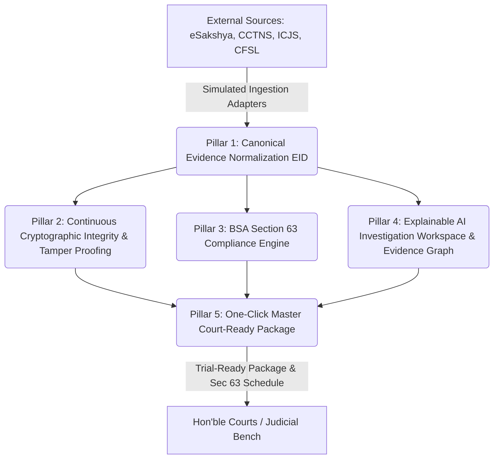

<div align="center">

# साक्षी SAKSHI
### **Secure Audit & Kernel for Shared High-integrity Investigations**
#### *सुरक्षित • सत्यापित • न्याय के लिए तैयार &nbsp;|&nbsp; SECURE • VERIFIABLE • COURT-READY*

<p align="center">
  
</p>

**A secure, interoperable Evidence Intelligence Platform that converts digital evidence into verifiable, traceable, BSA-compliant, investigation-ready and court-ready evidence.**

---

[](https://reactjs.org/)
[](https://vitejs.dev/)
[](https://tailwindcss.com/)
[%20%7C%20BNSS%20105-green?style=flat-square)](https://www.mha.gov.in)
[](https://csrc.nist.gov)

</div>

---

## 📌 Executive Summary & Architectural Positioning

### **The Fundamental Principle: Complement, Do Not Replace**
> *"SAKSHI does not replace India’s criminal-justice stack. It is the missing Evidence Intelligence & Court-Readiness Layer above CCTNS, ICJS, and eSakshya."*

In modern criminal jurisprudence under the **Bharatiya Sakshya Adhiniyam, 2023 (BSA)** and **Bharatiya Nagarik Suraksha Sanhita, 2023 (BNSS)**, digital evidence (CCTV recordings, cellular CDR/IPDR logs, UFDR mobile extractions, bodycam streams, disk images) suffers from three systemic vulnerabilities:
1. **Fragmentation Across Isolated Silos**: Police records (CCTNS), crime scene uploads (eSakshya), forensic labs (CFSL), and court registries (eCourts / ICJS) do not communicate evidentiary provenance.
2. **Vulnerability to Integrity & Chain-of-Custody Challenges**: Defense challenges frequently invalidate digital evidence over lack of continuous hash attestation and handling logs.
3. **Statutory Admissibility Bottlenecks**: Creating compliant **Section 63(4) BSA Certificates** is often delayed, manual, or improperly executed, leading to judicial rejection.

**SAKSHI bridges this gap** by establishing an automated canonical ingestion layer, sub-second continuous SHA-256 integrity verification, source-grounded explainable AI reasoning with clickable citations, and one-click statutory court package generation.

---

## 🏛️ SAKSHI 5 Core Pillars



### 1. Ingestion Adapters & Canonical Evidence Normalization
- **Universal Ingestion Connectors**: Ingests multi-modal digital evidence from **eSakshya**, **CCTNS**, and **ICJS** without altering existing departmental workflows.
- **Canonical Evidence Object (EID)**: Normalizes raw exhibits into a standardized schema (e.g. `EVD-2026-DL-9042`) containing hardware identifiers (IMEI/MAC), acquisition methodologies, and timestamped geolocations.

### 2. Continuous Cryptographic Integrity & Tamper Proofing
- **Sub-Second SHA-256 Verification**: Computes and continuously verifies cryptographic fingerprints against immutable primary vault copies.
- **Autonomous Drift & Tamper Detection**: Instant alarms flag unauthorized bit-level modifications and suspend Section 63 compliance until re-attested.
- **Immutable Chain-of-Custody**: Logs all transfers with digital officer signatures conforming to IT Act Section 5.

### 3. Bharatiya Sakshya Adhiniyam (BSA) Section 63 Statutory Engine
- **Section 63(4) Readiness Scorecard**: Validates proper device operation, lawful custodian identity, algorithm attestation, and acquisition parameters.
- **Automated Schedule Certificate Builder**: Dynamically compiles the statutory Section 63 Schedule Certificate ready for judicial filing.

### 4. Explainable AI Investigation Workspace & Evidence Graph
- **Source-Grounded Semantic Search / RAG**: Zero-hallucination investigative query engine.
- **Clickable EID Citations**: Every AI finding strictly cites verifiable Evidence IDs (`[EVD-2026-DL-9042]`) with timestamps and page offsets.
- **Multi-Entity Evidence Graph**: Visual relationship graph correlating Accused ↔ Mobile Numbers ↔ IMEI Devices ↔ CCTV Feeds ↔ Locations ↔ Case FIRs.

### 5. One-Click Master Court-Ready Package Generator
- Assembles a unified, verified judicial package for trial proceedings:
  - Digital Evidence Index with verified SHA-256 checksums
  - Statutory Section 63 BSA Schedule Certificate
  - Continuous Chain of Custody Audit Ledger
  - Prosecutor Exhibit Concordance Table (`Exhibit P-1`, `Exhibit P-2`, etc.)

---

## 👥 Role-Based Portals & Governance Architecture

SAKSHI enforces strict role-based access control (RBAC) across 7 specialized portals:

| # | Official Role | Dedicated Portal | Key Capabilities |
|---|---------------|------------------|------------------|
| **1** | **Central Admin** | Central Command & Monitoring Portal | National overview, cross-state alerts, inter-district tracking, system-wide governance |
| **2** | **District Admin** | District Operations Portal | District resource deployment, incident escalation, IO case assignments, high-priority alerts |
| **3** | **Investigating Officer (IO)** | Investigation & Case Management Portal | Case diary timeline, explainable AI search, clickable EID citations, evidence graph |
| **4** | **Women’s Safety Officer** | Women's Safety & Distress Records Portal | 112 distress call CAD logs, emergency response vehicle (ERV) tracking, rapid FIR linkage |
| **5** | **Evidence & Forensic Officer** | Evidence & Chain-of-Custody Portal | CFSL custody transfers, hash drift verification, tamper drills, BSA 63 metadata endorsement |
| **6** | **Legal / Prosecuting Officer** | Legal & Court Proceedings Portal | Trial dockets, exhibit concordance tables, BSA Section 63 certificate viewer, court package generator |
| **7** | **Senior Supervisory Officer** | Review & Approval Portal | Audit trail oversight, record modification approvals, officer clearance and integrity audits |

---

## 🛠️ Technology Stack

- **Core Framework**: [React 18](https://reactjs.org/) + [TypeScript](https://www.typescriptlang.org/)
- **Build Tool**: [Vite 5.4](https://vitejs.dev/)
- **Styling & UI Tokens**: [Tailwind CSS](https://tailwindcss.com/) with official Government of India color palette (`#162E52` Gov Navy, `#F5821F` Saffron, `#138808` India Green)
- **Icons**: [Lucide React](https://lucide.dev/)
- **Security & Cryptography**: Standard Web Cryptography API (SHA-256 bit-stream hashing)
- **State Management**: Centralized reactive Context API (`SakshiContext`)

---

## 🚀 Quick Start Guide

### Prerequisites
- Node.js (v18.0.0 or higher)
- npm (v9.0.0 or higher)

### Installation & Setup

1. **Clone the Repository**:
   ```bash
   git clone https://github.com/muskanangra/SAKSHI.git
   cd SAKSHI
   ```

2. **Install Dependencies**:
   ```bash
   npm install
   ```

3. **Start Development Server**:
   ```bash
   npm run dev
   ```
   Open your browser and navigate to `http://localhost:5173`.

4. **Production Build & Verification**:
   ```bash
   npm run build
   ```

---

## 🔒 Statutory & Regulatory Compliance

- **Bharatiya Sakshya Adhiniyam, 2023 (BSA)**: Section 57 (Primary Evidence), Section 63 (Admissibility of Electronic Records), Section 63(4) (Schedule Certificate).
- **Bharatiya Nagarik Suraksha Sanhita, 2023 (BNSS)**: Section 105 (Mandatory Videography & Digital Seizure).
- **Information Technology Act, 2000**: Section 5 (Digital Signatures), Section 79A (Examiner of Electronic Evidence).
- **National Informatics Centre (NIC)**: Designed for alignment with Tier-IV Cloud Security Guidelines and ICJS interoperability standards.

---

<div align="center">
  <sub>SAKSHI Evidence Intelligence Platform • Ministry of Home Affairs • Government of India</sub>
</div>
