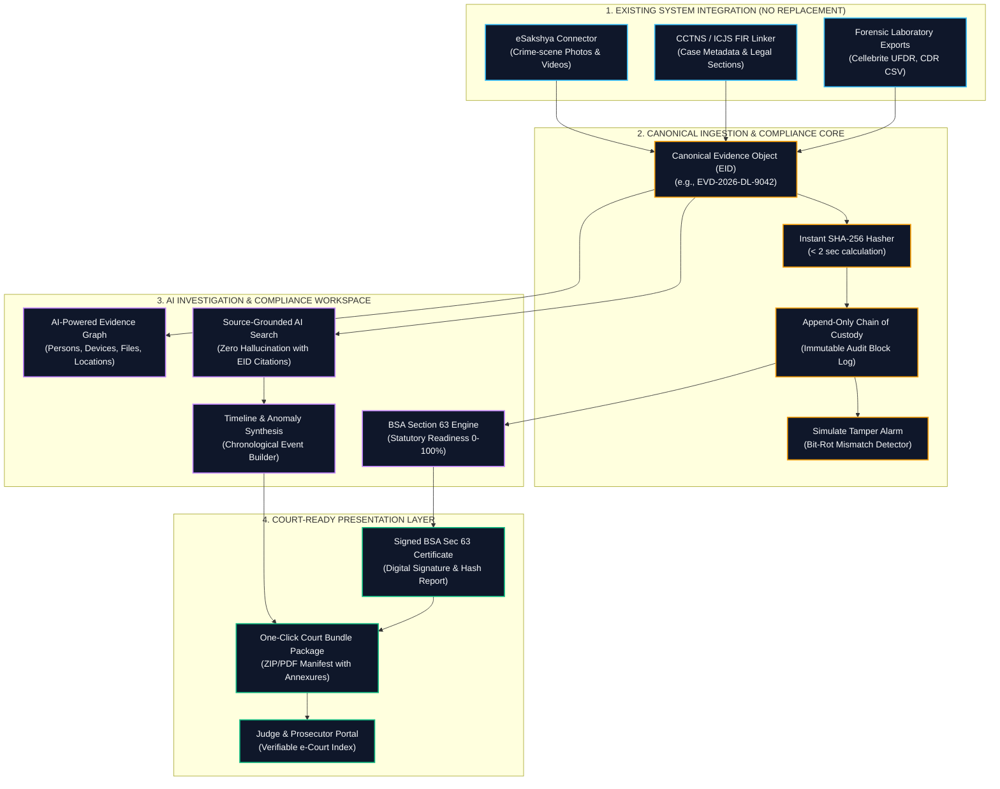
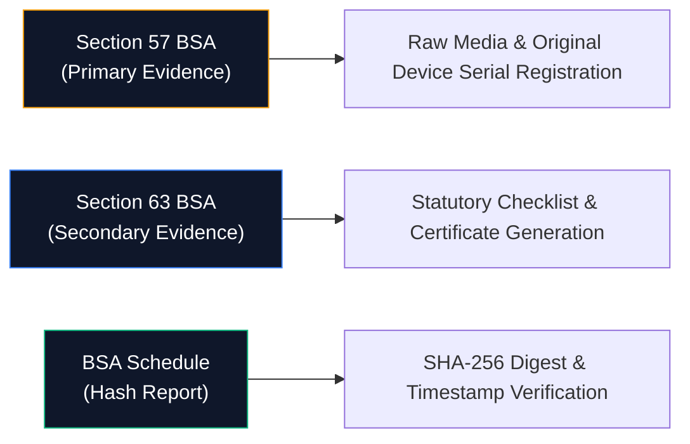

# SAKSHI: Evidence Intelligence & Court-Readiness Platform
### Smart India Hackathon (SIH PS 26190) Presentation Master Slide & Flowchart

---

## 🚀 Core Value Pipeline

---

## 🏗️ End-to-End System Solution Flowchart

---

## 📌 Executive Summary Matrix

| Category | Key Capabilities & Features | Strategic Impact |
| :--- | :--- | :--- |
| **💡 IDEA / SOLUTION** | • **Evidence Intelligence & Court-Readiness Platform** for secure management and intelligent processing of digital evidence. • **Evidence ID (EID)** for unique identification and traceability. • **SHA-256 Integrity Verification** for tamper detection. • **Digital Chain-of-Custody** for complete evidence provenance. • **AI-Powered Evidence Graph** for relationships and timelines. • **BSA Section 63 Readiness** and automated court-package generation. | Positions SAKSHI as an interoperability layer sitting above CCTNS / eSakshya without replacing existing police infrastructure. |
| **🎯 PROBLEM RESOLUTION** | • **Centralizes fragmented evidence workflows** without replacing existing systems. • **Ensures authenticity, integrity and provenance** throughout the evidence lifecycle. • **Reduces manual effort** in evidence verification and court preparation. • **Enables investigators to derive traceable, source-backed intelligence** from authorized evidence. | Solves the critical operational gap between raw crime-scene uploads and courtroom trial admissibility. |
| **⭐ UNIQUE VALUE PROPOSITIONS (UVP)** | • **Source-Grounded AI**: Every insight traces back to its source evidence ID. • **Continuous Integrity Verification**: Cryptographic hashing and real-time mismatch alarm. • **Evidence Intelligence Graph**: Connecting people, devices, files & events. • **BSA-Ready Workflow**: Automatically identifies missing statutory compliance requirements. • **One-Click Court Package**: Complete with evidence index, hashes & custody records. | Guarantees legally defensible AI output that judges can trust without risk of hallucination. |

---

## 🏛️ Bharatiya Sakshya Adhiniyam (BSA) 2023 Statutory Mapping

