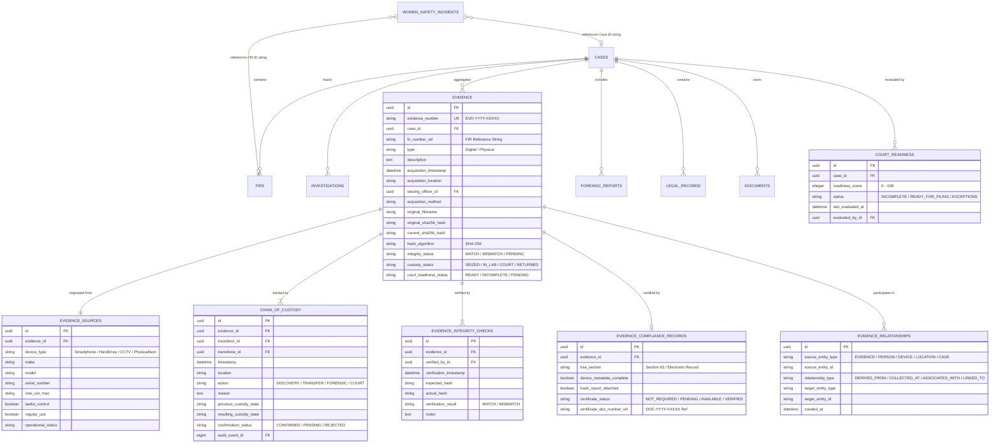
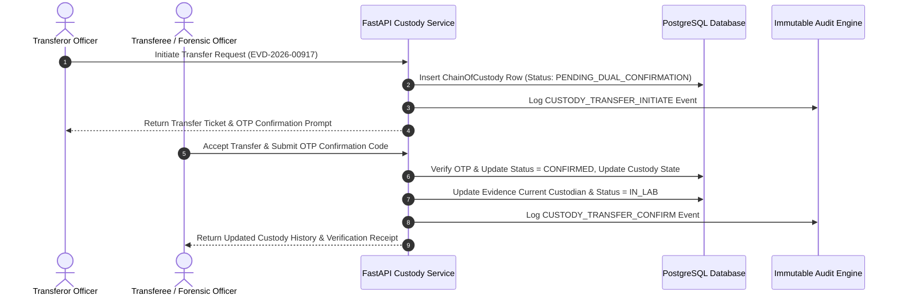

# Secure Digital Document Management System (SIH 26190)
## Complete System Architecture Specification & Enhanced Engineering Design

---

## 1. Executive Summary & Core Architectural Principles

The **Secure Digital Document Management System** (SIH Problem Statement 26190) is an enterprise-grade, multi-tenant law-enforcement and legal investigation platform. The system provides cryptographic confidentiality, integrity, availability, auditability, and non-repudiation across sensitive legal records, digital/physical evidence, police reports, and court documentation.

### 1.1 The Four-Layer Functional Architecture

The platform operates across four specialized processing layers:

```
+---------------------------------------------------------------------------------------------------+
|                                  FOUR-LAYER PRODUCT ARCHITECTURE                                  |
+------------------------------------+--------------------------------+-----------------------------+
| 1. Secure Case & Document Vault    | 2. Evidence Integrity          | 3. Evidence Intelligence    |
|    Central Case anchor, immutable  |    SHA-256 acquisition hashes,|    Relational entity graph,  |
|    document versioning & RBAC.     |    dual-confirmation custody.  |    provenance tracking.     |
+------------------------------------+--------------------------------+-----------------------------+
| 4. Court Readiness & Compliance    | CONCEPTUAL OPERATIONAL FLOW:                                 |
|    BSA electronic record checklist | STORE → VERIFY → TRACE → VALIDATE → PREPARE                  |
|    & readiness scoring engine.     |                                                              |
+------------------------------------+--------------------------------------------------------------+
```

```
+---------------------------------------------------------------------------------------------------+
|                                     CORE ARCHITECTURAL TENETS                                     |
+------------------------------------+--------------------------------+-----------------------------+
| 1. Backend-Enforced Security       | 2. Case-Centric Unity          | 3. Cryptographic Integrity  |
|    Frontend selection never        |    The Case is the central     |    SHA-256 hash per version|
|    grants permissions; RBAC is     |    anchor for FIRs, Evidence,  |    and immutable audit log |
|    enforced strictly at API layer. |    Investigations, and Docs.   |    hash-chaining.           |
+------------------------------------+--------------------------------+-----------------------------+
| 4. Append-Only Immutability        | 5. Controlled Collaboration    | 6. Intelligent Monitoring   |
|    Finalized documents & audit     |    Cross-district sharing is    |    AI anomaly detection     |
|    logs are never overwritten      |    explicit, read-only (View   |    with rule-based scoring  |
|    or destroyed.                   |    + Download only).           |    & 2-tier escalation.     |
+------------------------------------+--------------------------------+-----------------------------+
```

---

## 2. High-Level System Architecture

The application adopts a **Layered Micro-Modular Architecture** composed of a Single-Page Application (SPA) frontend, a stateless FastAPI API Gateway and Application Layer, a PostgreSQL relational database for structured metadata and relationships, Cloud Object Storage for physical file blobs, an asynchronous Security AI Anomaly Detection Engine, and a Government Ecosystem Integration Adapter Layer.

```mermaid
graph TB
    subgraph Presentation_Layer["1. Presentation Layer (React 18 + TypeScript + Vite + Tailwind CSS)"]
        UI_CentralAdmin["Central Admin Portal"]
        UI_DistrictAdmin["District Admin Portal"]
        UI_FIR["FIR / Police Portal"]
        UI_Inv["Investigation Portal"]
        UI_Evd["Evidence / Forensic Portal"]
        UI_Court["Legal / Court Portal"]
        UI_WS["Women Safety Portal"]
    end

    subgraph API_Gateway_Layer["2. API Gateway & Security Layer (FastAPI Backend)"]
        Gateway["REST API Router"]
        AuthMiddleware["JWT + OTP MFA Middleware"]
        RBACEngine["RBAC & Jurisdiction Authorization Engine"]
        AuditInterceptor["Automatic Immutable Audit Generator"]
    end

    subgraph Application_Services["3. Core Application Service Layer"]
        CaseService["Case Management Engine"]
        DocService["Document & Versioning Engine (SHA-256)"]
        EvidenceService["Evidence & Provenance Engine"]
        CustodyService["Chain of Custody Engine (Dual-OTP)"]
        ReadinessEngine["Court Readiness & BSA Compliance Engine"]
        SharingService["Cross-District Sharing Service"]
        WSService["Women Safety Incident Tracker"]
        SecurityAIService["AI Anomaly Detection & Risk Engine"]
    end

    subgraph Integration_Layer["4. Government Ecosystem Adapter Layer"]
        GovAdapters["CCTNS / ICJS / eSakshya / e-Forensics Adapter Boundary"]
    end

    subgraph Storage_Data_Layer["5. Data & Storage Layer"]
        subgraph Relational_DB["PostgreSQL 16 Relational Database"]
            DB_Auth["Users, Roles, Permissions"]
            DB_Cases["Cases, FIRs, Investigations"]
            DB_Evidence["Evidence, Sources, Relationships, Custody, Integrity Checks"]
            DB_Compliance["BSA Compliance & Court Readiness Records"]
            DB_Docs["Doc Metadata, Versions, Hashes"]
            DB_Audit["Immutable Audit Logs (Hash-Chained)"]
            DB_Alerts["Security Alerts & Escalations"]
        end
        subgraph Object_Storage["Cloud Object Storage (MinIO / S3)"]
            PDF_Vault["Encrypted Documents & Scans (.pdf)"]
            Media_Vault["Forensic Media & Images (.jpg, .raw)"]
        end
    end

    %% Flow Connections
    Presentation_Layer -->|HTTPS / JSON + Bearer JWT| Gateway
    Gateway --> AuthMiddleware
    AuthMiddleware --> RBACEngine
    RBACEngine --> AuditInterceptor
    AuditInterceptor --> Application_Services

    Application_Services -->|SQLAlchemy ORM / SQL| Relational_DB
    DocService -->|Boto3 / MinIO SDK (Temp Signed URLs)| Object_Storage
    DB_Audit -->|Async Stream Log Events| SecurityAIService
    SecurityAIService -->|Generate Risk Scores & Alerts| DB_Alerts
    Application_Services -.->|Standard Adapter Interface| GovAdapters
```

---

## 3. Case-Centric Core & Expanded Evidence Entity

The **Case** (`CASE-YYYY-XXXXX`) remains the master authorization and relationship boundary. Evidence (`EVD-YYYY-XXXXX`) is elevated to a **first-class object** with complete provenance, source device tracking, hash integrity verification, and BSA compliance metadata.



---

## 4. Chain of Custody & Dual-Confirmation Workflow

Chain of custody records are append-only. Transfers require explicit dual confirmation (transferor initiation + transferee confirmation) before state resolution.



---

## 5. Court Readiness & Compliance Engine

The Court Readiness engine evaluates deterministic completeness rules for a Case without taking automated legal decisions or using AI for admissibility scoring.

```mermaid
flowchart TD
    CaseReq[Case Court Readiness Request: CASE-2026-00142] --> Engine[Court Readiness Evaluator Engine]

    subgraph Checks["Deterministic Verification Checks"]
        C1["Check 1: FIR Linked? (Weight: 15%)"]
        C2["Check 2: Evidence Items Registered? (Weight: 15%)"]
        C3["Check 3: All Evidence SHA-256 Hashes Verified? (Weight: 25%)"]
        C4["Check 4: Chain of Custody Complete & Confirmed? (Weight: 15%)"]
        C5["Check 5: Forensic Reports Attached? (Weight: 10%)"]
        C6["Check 6: Source Device Metadata Present? (Weight: 10%)"]
        C7["Check 7: BSA Electronic Certificate Info Available? (Weight: 10%)"]
    end

    Engine --> Checks
    Checks --> ScoreCalc[Compute Readiness Percentage (0 - 100%)]

    ScoreCalc --> StatusAssign{Evaluate Readiness Status}
    StatusAssign -->|Score = 100%| StatusReady[Status: READY_FOR_FILING]
    StatusAssign -->|Score < 100%| StatusInc[Status: INCOMPLETE - Missing Items Flagged]

    StatusReady --> SummaryOutput[Generate Court Evidence Package Index]
    StatusInc --> SummaryOutput
```

---

## 6. AI Security Monitoring & Anomaly Rules

The AI Security engine consumes the stream of immutable audit log events to identify suspicious access and evidence tampering patterns:

| Rule ID | Rule Condition | Risk Score | Severity Band | Escalation Target |
|---|---|---|---|---|
| **R1** | >5 failed logins in 10 minutes | +40 | Medium | District Admin |
| **R2** | >20 document/evidence downloads in 5 minutes | +60 | High | District Admin |
| **R3** | Access between 01:00 AM – 04:00 AM | +25 | Info/Low | Dashboard Log |
| **R4** | Unauthorized cross-district access attempt | +50 | Medium | District Admin |
| **R5** | Suspicious activity by District Admin account | +80 | High/Critical | Central Admin |
| **R6** | Evidence SHA-256 Hash Mismatch detected | +90 | Critical | Central Admin + District Admin |
| **R7** | Unexpected/off-hours access to sensitive evidence | +55 | High | District Admin |

---

## 7. System Technology Stack Matrix

```
+---------------------------------------------------------------------------------------------------+
|                                  LOCKED SYSTEM TECH STACK MATRIX                                  |
+----------------------+---------------------------------+------------------------------------------+
| Component Layer      | Technology Selected             | Rationale & Operational Role             |
+----------------------+---------------------------------+------------------------------------------+
| Frontend Framework   | React 18 + TypeScript + Vite    | Type-safe SPA with modular portal routing|
| Styling & Primitives | Tailwind CSS + shadcn/ui        | Government digital design system tokens  |
| State & Fetching     | TanStack Query (React Query)    | Client cache & server state management   |
| Forms & Validation   | React Hook Form + Zod           | Type-safe form validation                |
| Routing              | React Router v6                 | Role-guarded route trees                 |
| Backend API          | FastAPI (Python 3.11+)          | Async REST API Gateway                   |
| ORM & Migrations     | SQLAlchemy 2.0 + Alembic        | Relational schema management             |
| Database             | PostgreSQL 16                   | ACID metadata, B-Tree indexes            |
| Object Storage       | MinIO / S3                      | Signed temporary URL file storage        |
| Auth & Crypto        | JWT + Argon2 + SHA-256          | MFA, password hashing, log hash-chaining |
| AI Anomaly Engine    | Python Rule Engine              | Audit log risk scoring & alert escalation|
+----------------------+---------------------------------+------------------------------------------+
```
